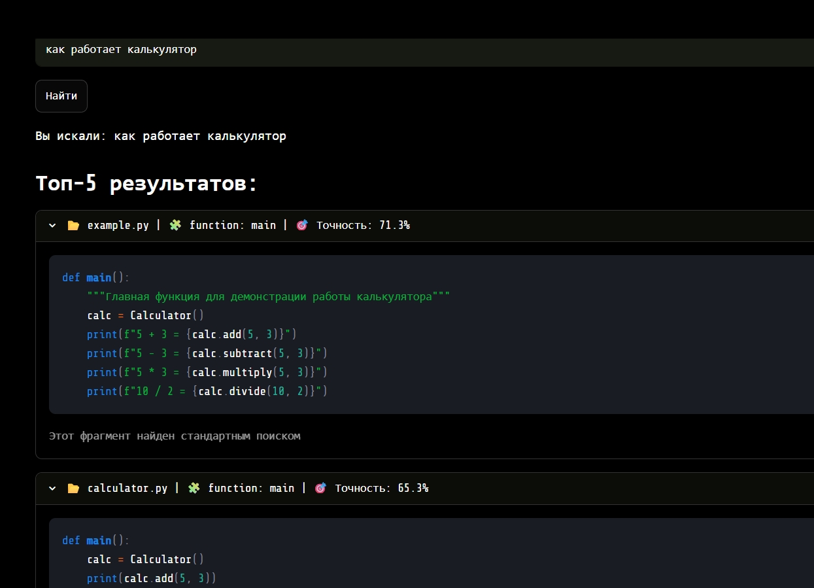
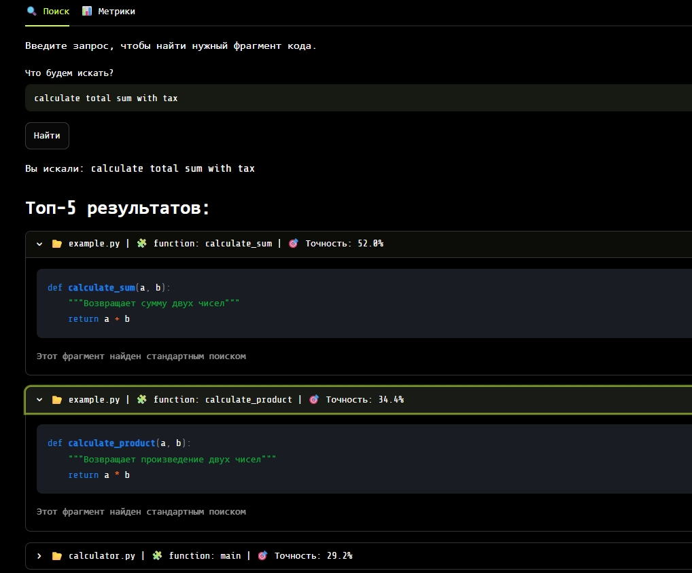

# CodeLens — Умный поиск по кодовой базе (RAG-система)

Прототип RAG-системы для семантического поиска по Python-коду. Система понимает вопросы на естественном языке (русский и английский) и находит релевантные фрагменты кода, даже если слова запроса не совпадают с именами функций и переменных.

## Архитектура системы

Система состоит из трёх основных компонентов, реализованных на Python:

mermaid
graph TD
    A[Python-кодовая база] -->|ast-парсинг| B[index.py]
    B -->|sentence-transformers| C[(ChromaDB)]
    D[Пользователь] -->|Запрос на естеств. языке| E[app.py / Streamlit]
    E -->|Вектор запроса| C
    C -->|Top-K ближайших чанков| E
    E -->|st.code с подсветкой| D
    
    style B fill:#4CAF50,color:#fff
    style C fill:#2196F3,color:#fff
    style E fill:#FF9800,color:#fff

| Компонент | Файл | Назначение |
| Индексатор | `index.py` → `indexer/indexer.py` | AST-парсинг `.py`-файлов, генерация эмбеддингов, запись в ChromaDB |
| Поисковый движок | `search_engine.py` | Векторный и гибридный (векторный + TF-IDF) поиск, расчёт Precision@5
| Веб-интерфейс | `app.py` | Streamlit-приложение: поле ввода, карточки результатов, страница метрик

## Запуск

### Локально:

Требования: Python 3.12

bash
# 1. Клонируйте репозиторий
git clone https://github.com/CaseyDunne/codelens-rag-system.git
cd codelens-rag-system

# 2. Создайте виртуальное окружение
python -m venv venv
source venv/bin/activate        # Linux/Mac
venv\Scripts\activate           # Windows

# 3. Установите зависимости
pip install -r requirements.txt

# 4. Проиндексируйте кодовую базу
python index.py <путь_к_папке_с_py-файлами>

# 5. Запустите веб-интерфейс
streamlit run app.py

Откройте в браузере: http://localhost:8501

### Через Docker:

bash
docker compose up

При первом запуске контейнер автоматически проиндексирует папку `test_code` и запустит UI. Повторные запуски используют сохранённую базу (через Docker volume).

Откройте: http://localhost:8501

## Стратегия чункования

Наше решение: один чанк = одна функция, класс или метод.

Обоснование:
- Функция / класс — это минимальная семантическая единица Python-кода. В её границах содержится законченная логика, имеющая смысл.
- AST-парсинг (встроенный модуль `ast`) позволяет извлекать эти единицы точно, без разрыва логики посередине — в отличие от нарезки по фиксированному числу строк или токенов.
- Вместе с фрагментом кода мы сохраняем контекст: путь к файлу, тип (function/class/method), имя, номера строк и docstring. Это повышает качество эмбеддингов и точность поиска.
- Такой подход напрямую улучшает нашу ключевую метрику — Precision@5.

## Обоснование выбора технологий

Наше решение и пояснение, почему мы выбрали именно его:
| Модель `paraphrase-multilingual-MiniLM-L12-v2` | Поддерживает русский и английский «из коробки», компактная (384 размерности), быстрая (~50 мс на эмбеддинг). Идеальна для семантического поиска по коду и естественному языку. 
| ChromaDB | Встроенная векторная БД на Python. Хранит эмбеддинги + метаданные в одном месте, работает из коробки без настройки сервера. Для нашего объёма (~80 файлов) разница в скорости с FAISS незаметна, а удобство интеграции — выше. 
| AST-парсинг | Точный синтаксический разбор Python. Сохраняет структуру кода (функции, классы, методы, docstring) — то, что теряется при нарезке регулярными выражениями. 
| Streamlit | Быстрый UI на Python без JavaScript. Позволяет за одну строку (`st.code(..., language="python")`) получить подсветку синтаксиса. 
| Гибридный поиск (опционально) | Комбинация векторного поиска (семантика) и TF-IDF (точное совпадение терминов) с настраиваемым весом `alpha`. Повышает точность на запросах со специфичными терминами. 

## Метрики качества

| Метрика | Значение | Как измерялось |
| Precision@5 (всего)| 73,3% | На датасете `eval_questions.json` (15 вопросов с эталонными ответами) 
| Precision@5 (русский) | 62,5% | На русскоязычных запросах 
| Precision@5 (английский) | 85,7% | На англоязычных запросах 
| Latency | 1 сек | Оценка на основе тестовых запросов
| Размер базы | 36 чанков | Проиндексировано из 2 файлов 

Метрики автоматически пересчитываются командой `python search_engine.py` и отображаются в отдельной вкладке Streamlit-интерфейса.
## Примеры запросов

### Пример 1: Поиск на русском языке
Запрос: «Как здесь обрабатываются ошибки авторизации?»

### Пример 2: Поиск на английском языке
Запрос: «calculate total sum with tax»

### Пример 3: Семантический поиск
Запрос: «Обработка ошибок авторизации»

### Пример 4: Поиск по классу или сложной логике
Запрос: «валидация пользователя»

### Пример 5: Поиск на английском языке
Запрос: «mathematical operations implementation»

## Роли в команде
| Роль | зона ответственности |
| Инженер по индексации | AST-парсинг, чанкинг, генерация эмбеддингов, запись в ChromaDB 
| Бэкенд-разработчик | Векторный и гибридный поиск, расчёт Precision@5, API для UI 
| UI-инженер | Streamlit-приложение: карточки результатов, подсветка, страница метрик 
| Интегратор | Точка входа `index.py`, `requirements.txt`, Docker Compose, документация

## Известные ограничения
- Поддерживается только Python-код (через `ast`).
- LLM-генерация связных ответов не реализована в текущей версии.
- Модель эмбеддингов кэшируется в `~/.cache/huggingface/` (~471 МБ при первом запуске).
